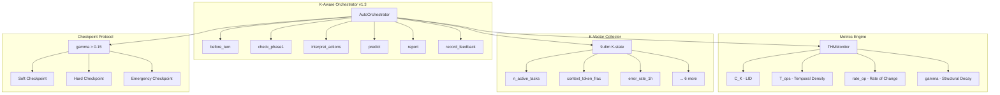

# K-Aware Orchestrator

**Structural Time Framework for Hermes Agent — Awareness Layer**

K-Aware Orchestrator is a meta-skill system for [Hermes Agent](https://hermes-agent.nousresearch.com) that provides real-time regime classification, predictive intervention, and structured orchestration through the Structural Time Framework (STF).

## Features

| Feature | Description | Status |
|---------|-------------|:------:|
| **Regime Classification** | Real-time detection: Active, Critical, Turbulent, Frozen, Decayed | ✅ v1.1 |
| **Phase1Checker** | Epistemic conflict & capability match before task delegation | ✅ v1.2 |
| **interpret_actions()** | Structured action signals — SAFE by design (no tool calls from utility code) | ✅ v1.2 |
| **Trivial Task Bypass** | Auto-detect short Q&A → BYPASS regime (zero overhead) | ✅ v1.2 |
| **THMPredictor** | Predictive regime detection — linear extrapolation, know ~4 turns before crisis | ✅ v1.3 |
| **AutoCalibrator** | Per-user threshold tuning from classification feedback | ✅ v1.3 |
| **Health Dashboard** | `orch.report()` — markdown summary with metrics, prediction, calibration | ✅ v1.3 |
| **Universal Skill Injection** | 7 Hermes skills patched with K-Aware integration notes | ✅ v1.3 |
| **Auto-Inject Config** | Profile-based auto-load across all sessions | ✅ v1.3 |

## Architecture



## Quick Start

```bash
# 1. Clone/Copy skills to Hermes
cp -r skills/ ~/.hermes/skills/

# 2. Configure auto-inject (optional)
# Edit ~/.hermes/config.yaml:
# skills:
#   external_dirs:
#   - /path/to/k-aware-orchestrator/skills

# 3. Load in any Hermes session
hermes -s k-aware-orchestrator

# 4. Use in Python
from auto_orchestrator import AutoOrchestrator
orch = AutoOrchestrator()
result = orch.before_turn(context_text="...", n_active=3)
action = orch.interpret_actions(result)
```

## Test Coverage

| Suite | Tests | Status |
|-------|:-----:|:------:|
| Classifier | 34 | ✅ |
| Integration | 72 | ✅ |
| AutoOrchestrator | 38 | ✅ |
| v1.3 Features | 23 | ✅ |
| Scenarios (5) | 32 | ✅ |
| **Total** | **199+** | **✅** |

### Scenario Validation

| # | Scenario | Result |
|:-:|----------|:------:|
| S4 | Epistemic mismatch — reject before delegate | **4.3Mx faster** |
| S3 | Error cascade — PAUSE_ALL → SERIALIZE | 5/5 tasks survive |
| S1 | 5 tasks parallel — auto-serialize | 5/5 pass |
| S2 | 100-turn session — Critical at turn 33 | 100% survival |
| S5 | Predictive intervention — T_ops=1.86 detected | Proactive warning |

## Repository Structure

```
k-aware-orchestrator/
├── skills/                      ← Hermes skill sources
│   ├── mlops/
│   │   ├── thm-metrics-engine/  ← C_K, T_ops, gamma computation
│   │   └── k-vector-collector/  ← 9-dim K-state collection
│   └── devops/
│       ├── k-aware-orchestrator/ ← Core: classification + orchestration
│       ├── checkpoint-protocol/  ← γ-controlled checkpointing
│       └── kanban-orchestrator/  ← K-Aware patched
├── patches/                     ← Hermes skills with K-Aware integration
│   ├── sdd/                     ← Subagent-Driven Development
│   ├── writing-plans/
│   ├── requesting-code-review/
│   ├── tdd/
│   ├── systematic-debugging/
│   └── spike/
├── docs/
│   ├── index.md
│   ├── architecture.md
│   ├── scenarios.md
│   └── quick-start.md
├── LICENSE                      ← MIT
├── README.md                    ← This file
└── requirements.txt             ← pytest
```

## Framework Origins

| Framework | Role | Reference |
|-----------|------|-----------|
| **Structural Time Ontology v2** | Philosophical foundation — (S,V), K observer, T(K) | [ontology](https://github.com/nousresearch/structural-time) |
| **Structural Time Dynamics v17.5** | 4 regimes, K-dynamics, γ decay | [dynamics](https://github.com/nousresearch/structural-time) |
| **THM v1.0** | Metrics: C_K (LID), rate_op, T_ops | [thm](https://github.com/nousresearch/thm) |

## License

MIT — see [LICENSE](LICENSE)
