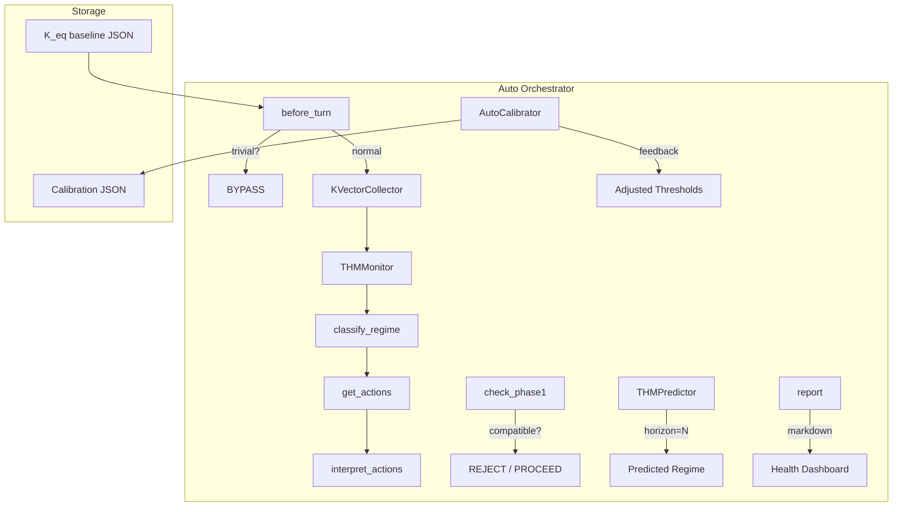

# Architecture

## Layered Design

```
┌────────────────────────────────────────────────────────┐
│   K-Aware Orchestrator (AWARENESS) — v1.3               │
│   "รู้ว่าระบบเป็นยังไง + จะเป็นอะไร"                    │
│   regime classification → predict → structured action  │
├────────────────────────────────────────────────────────┤
│   kanban-orchestrator + SDD (WORKFLOW)                 │
│   "รู้ว่าต้องทำอะไร — แต่เช็ค K-Aware ก่อน"             │
├────────────────────────────────────────────────────────┤
│   Specialist Skills (EXECUTION)                        │
│   "ทำจริง"                                             │
└────────────────────────────────────────────────────────┘
```

## Component Diagram



## Data Flow

### Per-Turn Protocol

```
1. User sends message
2. before_turn():
   ├─ Is trivial? → BYPASS (return immediately)
   ├─ Cooldown active? → Return cached result
   ├─ Record context + tool call
   ├─ Collect 9-dim K-vector
   ├─ Normalize → compute C_K, rate_op, T_ops, γ
   ├─ Classify regime (fallback or full)
   └─ Save K_eq if calibrated
3. check_phase1() (ก่อน delegate_task):
   ├─ Capability: task_caps ⊆ agent_caps?
   ├─ Resource: n_active < max_load?
   ├─ Valid state: task ∈ V?
   └─ Epistemic: n_active < max_load - 1?
4. interpret_actions():
   └─ Return structured action signal
5. predict(horizon=N):
   └─ Linear extrapolation on T_ops/rate_op
6. record_feedback(was_correct):
   └─ Auto-calibrate thresholds every 10 entries
```

## K-Vector (9 Dimensions)

| # | Dimension | Source | Range |
|---|-----------|--------|-------|
| 1 | n_active_tasks | todo() items | ≥ 0 |
| 2 | n_parallel_agents | delegate_task count | ≥ 0 |
| 3 | task_depth_mean | Task tree depth | ≥ 0 |
| 4 | context_token_frac | Char-based proxy ⚠️ | [0, 1] |
| 5 | memory_retrieval_rate | session_search/hour | ≥ 0 |
| 6 | cross_agent_messages | delegate_task interactions | ≥ 0 |
| 7 | error_rate_1h | Tool failure rate | [0, 1] |
| 8 | retry_count | Retries in window | ≥ 0 |
| 9 | user_interruption_rate | Interruptions/hour | ≥ 0 |

## Regime Thresholds

| Regime | Primary Condition | Action |
|--------|-----------------|--------|
| **Active** | default | DELEGATE_NORMAL |
| **Critical** | T_ops > 0.5, C_K > 5 | SERIALIZE |
| **Turbulent** | \|T_ops\| > 2.0, rate > 1.5 | PAUSE_ALL |
| **Frozen** | \|γ\| < 0.1, rate < 0.01, C_K < 3 | ESCALATE |
| **Decayed** | γ > 0.15 | CHECKPOINT |
| **BYPASS** | Auto-detected trivial | — |

Priority: Turbulent > Decayed > Frozen > Critical > Active > BYPASS

## Cross-Session Persistence

```
~/.hermes/k_eq_baseline.json        ← K_eq bootstrap
~/.hermes/k_aware_calibration.json  ← Threshold calibration
```
